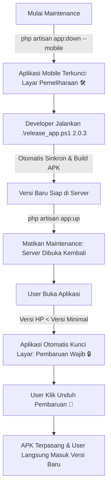

# 📘 PANDUAN LENGKAP: MAINTENANCE SISTEM & FORCE UPDATE OTOMATIS (KAI STYLE)
> **Proyek**: NitipDong / BelanjaIn  
> **Arsitektur**: *Scheduled Maintenance with Version Gate (Mandatory App Version Enforcement)*

Dokumen ini adalah Standar Operasional Prosedur (SOP) untuk melakukan pemeliharaan server (*maintenance*) dan merilis pembaruan aplikasi mobile secara otomatis tanpa merepotkan developer maupun pengguna.

---

## ⚡ 1. CARA INSTAN 1 PERINTAH (OTOMATISASI PENUH)

Untuk memudahkan developer agar **tidak perlu ubah banyak file secara manual**, gunakan salah satu perintah otomatis ini:

### 🌟 Opsi A: 1-Click All-in-One Release Script (Paling Mudah)
Cukup jalankan script ini di terminal PowerShell root project:
```powershell
.\release_app.ps1 2.0.3
```
*Script ini otomatis melakukan 5 hal sekaligus:*
1. Mengubah versi di `.env` (`APP_MOBILE_LATEST_VERSION=2.0.3` & `APP_MOBILE_MIN_VERSION=2.0.3`).
2. Mengubah versi di `nitipdong_mobile/pubspec.yaml` (auto-increment build number).
3. Mengubah versi di `nitipdong_mobile/lib/services/api_service.dart`.
4. Membangun APK Release (`flutter build apk --release`).
5. Menyalin file APK ke `public/downloads/nitipdong.apk` dan membersihkan cache sistem.

---

### 🌟 Opsi B: Menggunakan Artisan Command
Jika kamu hanya ingin menyinkronkan seluruh versi sistem (Web, API, Flutter, dan .env):
```bash
php artisan app:release 2.0.3 --force
```

---

## 🎯 2. Konsep & Cara Kerja Sistem

Sistem ini meniru arsitektur enterprise aplikasi besar (seperti **KAI Access**, **Perbankan/BCA**, dan **E-Commerce**):



---

## 🕒 3. SOP Skenario Nyata (Contoh: Maintenance Jam 22.00 - 00.30 WIB)

### 📌 Langkah 1: Pukul 22.00 WIB (Nyalakan Maintenance)
Jalankan perintah ini di terminal server:
```bash
php artisan app:down --mobile --message="Pemeliharaan server sedang berlangsung (22.00 - 00.30 WIB). Kami sedang mempersiapkan fitur baru untuk pengalaman belanja terbaik!"
```
* **Kondisi User**: Semua user yang membuka aplikasi akan langsung melihat layar **Mode Pemeliharaan 🛠️** dan transaksi dikunci sementara agar database aman saat proses migrasi/deploy.

---

### 📌 Langkah 2: Pukul 00.00 - 00.20 WIB (Build & Deploy Otomatis)
Cukup jalankan 1 perintah:
```powershell
.\release_app.ps1 2.0.3
```
*Semua versi di Flutter, `.env`, landing web, QR code, dan file APK di server akan tersinkronisasi 100% otomatis.*

---

### 📌 Langkah 3: Pukul 00.30 WIB (Buka Server Kembali)
Matikan mode maintenance di server:
```bash
php artisan app:up
```

---

### 🚀 Apa yang Terjadi pada Pengguna Setelah Jam 00.30 WIB?
1. **Pengguna Membuka Aplikasi (atau Klik "Muat Ulang" di Layar Maintenance)**:
   * Aplikasi mengecek ke server: `is_maintenance: false`, tetapi server mensyaratkan versi minimum `2.0.3`.
   * Karena versi di HP pengguna masih `2.0.2`, aplikasi **langsung mengunci layar dan membuka "Pembaruan Wajib Sistem 🔒"**.
2. **Pengguna Menekan Tombol "Unduh Pembaruan Sekarang 🚀"**:
   * Browser HP (Chrome/Safari) langsung mengunduh file `NitipDong-v2.0.3.apk` dengan kecepatan penuh.
   * Pengguna tap notifikasi unduhan selesai untuk memasang APK baru menimpa versi lama.
   * **Data akun, keranjang, dan login pengguna tetap aman tanpa perlu login ulang!**

---

## 📋 4. Ringkasan Variabel Konfigurasi (`.env`)

| Variabel `.env` | Deskripsi | Contoh Nilai |
| :--- | :--- | :--- |
| `APP_MOBILE_LATEST_VERSION` | Nomor versi APK rilis paling baru di server | `2.0.3` |
| `APP_MOBILE_MIN_VERSION` | Batas versi minimal yang boleh akses (jika versi HP < nilai ini, otomatis Force Update) | `2.0.3` |
| `APP_MOBILE_MAINTENANCE` | Toggle manual mode maintenance mobile (`true`/`false`) | `false` |
| `APP_MOBILE_MAINTENANCE_TITLE` | Judul pesan di layar maintenance | `Mode Pemeliharaan & Pengembangan 🛠️` |
| `APP_MOBILE_MAINTENANCE_MESSAGE` | Pesan deskripsi detail estimasi maintenance | `Sedang dalam pembaruan sistem...` |

---

## 🗂️ 5. Perintah-Perintah Penting Developer

| Perintah | Fungsi |
| :--- | :--- |
| `.\release_app.ps1 [versi]` | **1-Click**: Otomatisasi versi, build APK, deploy ke downloads, clear cache |
| `php artisan app:release [versi] --force` | Otomatisasi sinkronisasi nomor versi ke seluruh file backend & mobile |
| `php artisan app:down --mobile` | Mengaktifkan mode maintenance khusus aplikasi mobile |
| `php artisan app:down --web` | Mengaktifkan mode maintenance khusus website |
| `php artisan app:up` | Mematikan mode maintenance dan membuka kembali seluruh sistem |

---

*Dokumen ini dibuat otomatis sebagai panduan operasional standar tim pengembang NitipDong.*
