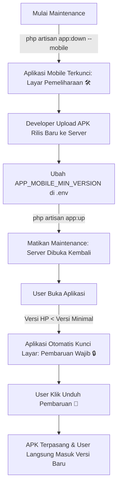

# 📘 PANDUAN LENGKAP: MAINTENANCE SISTEM & FORCE UPDATE OTOMATIS (KAI STYLE)
> **Proyek**: NitipDong / BelanjaIn  
> **Arsitektur**: *Scheduled Maintenance with Version Gate (Mandatory App Version Enforcement)*

Dokumen ini adalah Standar Operasional Prosedur (SOP) untuk melakukan pemeliharaan server (*maintenance*) dan merilis pembaruan aplikasi mobile secara otomatis tanpa merepotkan developer maupun pengguna.

---

## 🎯 1. Konsep & Cara Kerja Sistem

Sistem ini meniru arsitektur enterprise aplikasi besar (seperti **KAI Access**, **Perbankan/BCA**, dan **E-Commerce**):



---

## 🕒 2. SOP Skenario Nyata (Contoh: Maintenance Jam 22.00 - 00.30 WIB)

### 📌 Langkah 1: Pukul 22.00 WIB (Nyalakan Maintenance)
Jalankan perintah ini di terminal server:
```bash
php artisan app:down --mobile --message="Pemeliharaan server sedang berlangsung (22.00 - 00.30 WIB). Kami sedang mempersiapkan fitur baru untuk pengalaman belanja terbaik!"
```
* **Kondisi User**: Semua user yang membuka aplikasi akan langsung melihat layar **Mode Pemeliharaan 🛠️** dan transaksi dikunci sementara agar database aman saat proses migrasi/deploy.

---

### 📌 Langkah 2: Pukul 00.00 - 00.20 WIB (Build & Deploy Versi Baru)

1. **Ubah Versi di Flutter** (`nitipdong_mobile`):
   * Buka file `pubspec.yaml` ➔ naikkan versi, contoh:
     ```yaml
     version: 2.0.3+22
     ```
   * Buka file `lib/services/api_service.dart` line 13:
     ```dart
     static const String currentAppVersion = '2.0.3';
     ```

2. **Build APK Rilis**:
   Buka terminal di folder `nitipdong_mobile`:
   ```bash
   flutter build apk --release
   ```

3. **Upload File APK ke Server Hosting**:
   Ambil file dari `nitipdong_mobile/build/app/outputs/flutter-apk/app-release.apk`, lalu ganti file di server:
   * 📁 `public/downloads/nitipdong.apk`
   * 📁 `public/downloads/NitipDong-latest.apk`

4. **Kunci Versi di `.env` Server**:
   Buka file `.env` di server/cPanel, ubah baris ini:
   ```env
   # Versi terbaru yang ada di server
   APP_MOBILE_LATEST_VERSION=2.0.3

   # Batas versi MINIMAL yang diizinkan membuka aplikasi (Pemicu Force Update)
   APP_MOBILE_MIN_VERSION=2.0.3
   ```
   Lalu bersihkan cache config:
   ```bash
   php artisan config:clear
   ```

---

### 📌 Langkah 3: Pukul 00.30 WIB (Buka Server Kembali)
Matikan mode maintenance di server:
```bash
php artisan app:up
```

---

### 🚀 Apa yang Terjadi pada Pengguna Setelah Jam 00.30 WIB?
1. **Pengguna Membuka Aplikasi (atau Klik "Muat Ulang" di Layar Maintenance)**:
   * Aplikasi mengecek ke server: `is_maintenance: false`, tetapi server mensyaratkan versi minimum `2.0.3`.
   * Karena versi di HP pengguna masih `2.0.2`, aplikasi **langsung mengunci layar dan membuka "Pembaruan Wajib Sistem 🔒"**.
2. **Pengguna Menekan Tombol "Unduh Pembaruan Sekarang 🚀"**:
   * Browser HP (Chrome/Safari) langsung mengunduh file `NitipDong-v2.0.3.apk` dengan kecepatan penuh.
   * Pengguna tap notifikasi unduhan selesai untuk memasang APK baru menimpa versi lama.
   * **Data akun, keranjang, dan login pengguna tetap aman!**

---

## 📋 3. Ringkasan Variabel Konfigurasi (`.env`)

| Variabel `.env` | Deskripsi | Contoh Nilai |
| :--- | :--- | :--- |
| `APP_MOBILE_LATEST_VERSION` | Nomor versi APK rilis paling baru di server | `2.0.3` |
| `APP_MOBILE_MIN_VERSION` | Batas versi minimal yang boleh akses (jika versi HP < nilai ini, otomatis Force Update) | `2.0.3` |
| `APP_MOBILE_MAINTENANCE` | Toggle manual mode maintenance mobile (`true`/`false`) | `false` |
| `APP_MOBILE_MAINTENANCE_TITLE` | Judul pesan di layar maintenance | `Mode Pemeliharaan & Pengembangan 🛠️` |
| `APP_MOBILE_MAINTENANCE_MESSAGE` | Pesan deskripsi detail estimasi maintenance | `Sedang dalam pembaruan sistem...` |

---

## 🗂️ 4. Referensi File Kunci Terkait

### Backend (Laravel):
* `app/Http/Controllers/Api/SystemConfigController.php` *(API status sistem, maintenance, dan versi)*
* `routes/web.php` *(Route pintar pengunduhan `/download/app` & `/download/android`)*
* `resources/views/welcome.blade.php` *(Halaman landing web & QR Code otomatis)*
* `resources/views/errors/503.blade.php` *(Halaman maintenance web publik)*

### Frontend Mobile (Flutter):
* `nitipdong_mobile/lib/services/api_service.dart` *(Helper perbandingan versi `isVersionLower`)*
* `nitipdong_mobile/lib/screens/splash_screen.dart` *(Version Gate interceptor saat awal buka aplikasi)*
* `nitipdong_mobile/lib/screens/maintenance_screen.dart` *(Layar pemeliharaan & deteksi otomatis pasca-maintenance)*
* `nitipdong_mobile/lib/screens/update/app_update_progress_screen.dart` *(Layar pembaruan wajib & download stream)*

---

*Dokumen ini dibuat otomatis sebagai panduan operasional standar tim pengembang NitipDong.*
